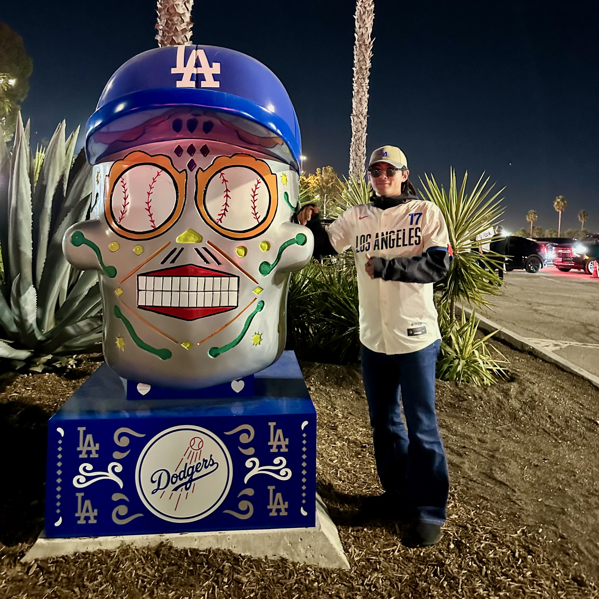

---

<table>
  <tr>
    <td style="vertical-align:top;">
      <h1>Ryuhei Miyazato</h1>
      

        I am a 2nd year master’s student at the University of Electro-Communications 
        and a member of Harada Laboratory.
      

      <ul>
        <li>Email: miyazato(at)uec.ac.jp</li>
        <li>GitHub: <a href="https://github.com/ryuhei-miyazato">@ryuhei-miyazato</a></li>
        <li>X: <a href="https://x.com/zakct_irynb">@zackt_irynb</a></li>
        <li>LinkedIn: <a href="https://www.linkedin.com/in/ryuhei-miyazato-538b17285/">@ryuhei-miyazato</a></li>
      </ul>
    </td>
    <td style="text-align:right; vertical-align:top; padding-left:24px;">
      
    </td>
  </tr>
</table>

---

## Profile

- **Affiliation**:  The University of Electro-Communications
- **Position**: 2nd year master’s student
- **Field of Research**:  Natural Language Processing, Machine Learning, Recommender Systems
- **Research Interests**: I am interested in exploring the internal representations within LLMs, with a particular focus on understanding the dynamics of how beliefs and perspectives evolve and integrate over time in narrative and conversational contexts.

---

## Work Experience

| Period         | Organization         | Role/Position       | Description                              |
|:-------------- |:------------------- |:-------------------|:-----------------------------------------|
| 2025.04–Present| Ichikara Inc., Tokyo, Japan| outsourcing | Synthesising of the DPO dataset.  |
| 2024.08–2024.11| DOCOMO Innovations, Inc., California, United States |  Research intern in the AI & Data Analytics Group | Personalized Book Summarization and Implementation of RAG for multiple domains documents within the company. |

---

## Education

| Period         | Institution         | Degree             | Major/Thesis                             |
|:-------------- |:-------------------|:-------------------|:-----------------------------------------|
| 2024.04–2026.03(expected)| The University of Electro-Communications   |MSc | Design Thinking and Data Science                    |
| 2020.04–2024.03| The University of Electro-Communications   | BSc  | Design Thinking and Data Science |
| 2017.07-2020.03 | Simizu Higashi High School | High school | Soccer Recommendation

---

## Publications

### Peer-reviewed Papers
1. **Book Recommendation System in University Libraries**, R.Miyazato, T.Nishino, K.Harada, IPSJ TOM, 2025. https://ipsj.ixsq.nii.ac.jp/records/2000549

### Conference Proceedings
-  **Aspect-Based Novel Summarization with Relational Extraction Using Large Language**, R. Miyazato, H.Wu, K.Harada, K.Okamoto, A.Shibata,  JSAI2025, 2025.5
- **Book Recommendation System for University Libraries**, R. Miyazato, T. Nishino, K. Harada,  SIG Mathematical Modeling and Problem Solving: MPS, 2024.6

### PREPRINT
- **BookAsSumQA: Evaluation of Aspect-Based Book Summarization via Question Answering**, 2025
- **Ensembling Multiple Hallucination Detectors Trained on VLLM Internal Representations**, 2025

### Awards
- 5th place at the [Meta CRAG-MM Challenge, KDD Cup 2025](https://www.aicrowd.com/challenges/meta-crag-mm-challenge-2025)

---